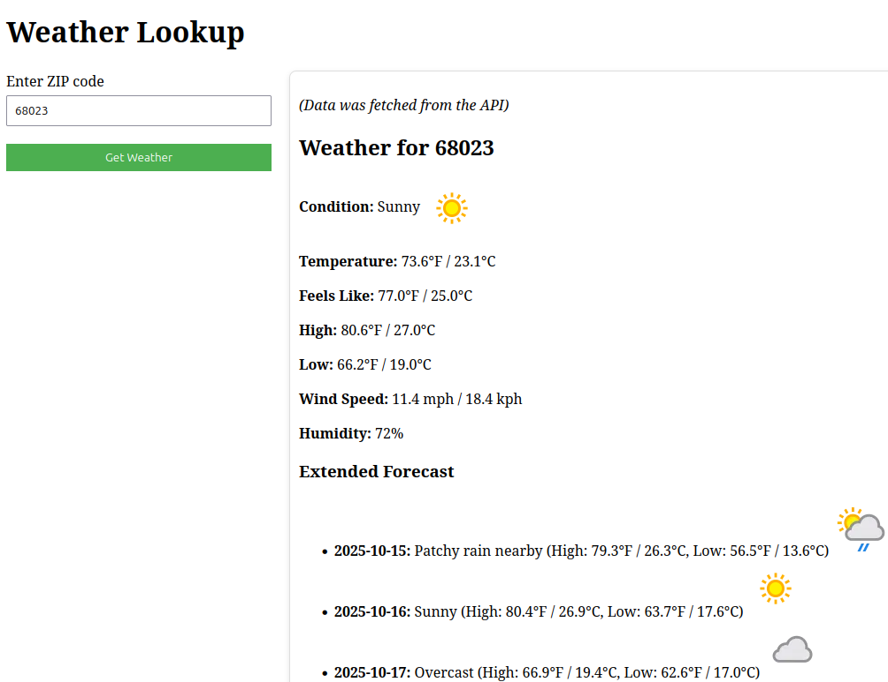
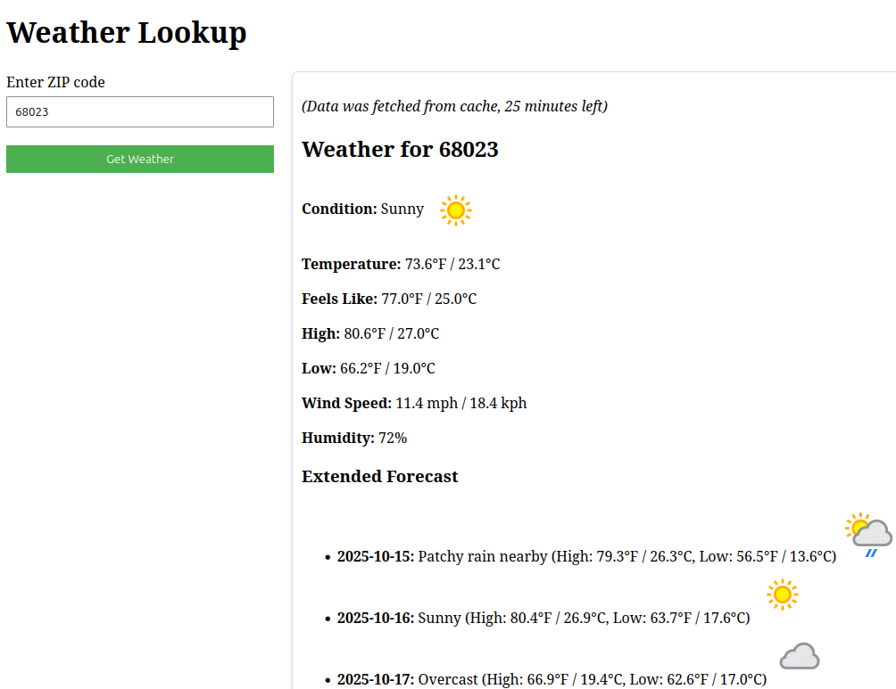
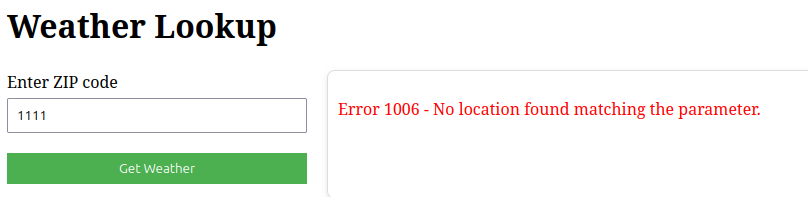

# Weather Lookup

This application retrieves and caches weather forecast data based on a given zip code.
The application uses Docker for containerization and Redis for caching.

## Technologies Used

- **Ruby on Rails 8.0.3**
- **Redis**: Used for caching weather data for 30 minutes.
- **[Free Weather API](https://www.weatherapi.com/)**: External API for fetching weather data.
- **Docker**: Containerized the application for consistency across environments.
- **RSpec**: For testing the application.
- **HTTParty**: For making HTTP requests to the WeatherAPI.

## Setup

1. **Clone the repository**:
   ```bash
   git clone git@github.com:RodrigoNM/weather-lookup.git
   cd weather-lookup
   ```

2. **Create `.env` file**:
   Add your WeatherAPI key:
   ```bash
   WEATHER_API_KEY=your_weather_api_key
   ```

3. **Build and start the application**:
   ```bash
   docker compose up --build
   ```

4. **Access the application**:
   The app will be available at [http://localhost:3000](http://localhost:3000).

## Running Tests

**Inside the container**:
   ```bash
   docker compose exec web bundle exec rspec
   ```
## Possible Improvements

 - **Add a PostgreSQL Database** Integrate a PostgreSQL database with a JSONB column to store weather data. This would allow historical tracking, analytics, and insights API usage.
 - **Use the VCR Gem for Testing** Implement the [VCR gem](https://github.com/vcr/vcr) to record and replay API responses during test runs.
 - **Zip Code Validation** Add logic to validate and normalize zip code formats before making API requests.

  ### Note:
  
  >Zip code validation hasn’t been implemented yet because each country has its own postal code format, adding strict validation without knowing the target audience could cause more issues than it solves.
  >For now, the system relies on the WeatherAPI’s built-in validation and error responses.

## Screenshots:

Fetched from API:


Fetched 5 minutes ago:


Invalid zip code:
